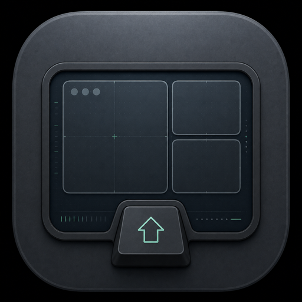

<p align="center">
  
</p>

# Shiftly

Keyboard window snapping I built for macOS that bypasses the Secure Input problems swish has.

Same workflow but keyboard driven here. You hold down a modifier key, tap arrow keys to move a window's placement (shown as a colored rectangle), release to move the window there. You have different modifiers for halves, quarters, thirds, sixths, and multi-display moves.

## Why

Window managers like Swish and Rectangle read the keyboard through a CGEventTap. MacOS Secure Input, which a lot of apps grab via a password field, blinds event taps system-wide. This has recently become an issue as recently Electron apps have a habit of grabbing it and it breaks until we reboot.

Shiftly avoids the event tap entirely (but not w/o some drawbacks). 

Hotkeys come in through Carbon's `RegisterEventHotKey`, which WindowServer dispatches even while Secure Input is held (same mechanism that keeps Spotlight's Cmd+Space alive in a password field). Release detection polls `CGEventSource.flagsState`, a state query rather than an event stream, and window moves go through the Accessibility API. These all together lets us avoid the Secure Input problems. 

This _does_ mean that we are grabbing these modifier keys in essentially any context. You can change the modifers in the menu bar settings to avoid conflicts with other application keybindings if you'd like.

## Gestures

| Layer | Default | Arrows |
|---|---|---|
| Halves & quarters | Cmd | Left/Right snap to halves, Up maximizes, Down centers. Combine them for quarters - Left then Up and you get the top-left quarter. |
| Thirds & sixths | Cmd+Opt | Left/Right walk the window across the screen: left 1/3, left 2/3, middle 1/3, right 2/3, right 1/3. Up/Down will grab the upper or lower half of whatever slot you're in. |
| Displays | Cmd+Shift | Sends the window to the display in that direction, keeping its relative size and position. |

## Install

```sh
git clone https://github.com/jackowfish/shiftly
cd shiftly
./build.sh
open build/Shiftly.app
```

Grant Accessibility when prompted (System Settings, Privacy & Security, Accessibility). Without it the app can see your keys but can't move anything.

The build signs with a `Shiftly Dev Signing` certificate if one exists in your keychain, and falls back to ad-hoc signing otherwise.

## Settings

All settings are in the menu bar item. Currently thats per-layer modifier combos, placement rectangle color (or off entirely, which moves windows live on each press), and animation speed. Settings persist across restarts.

## License

MIT
